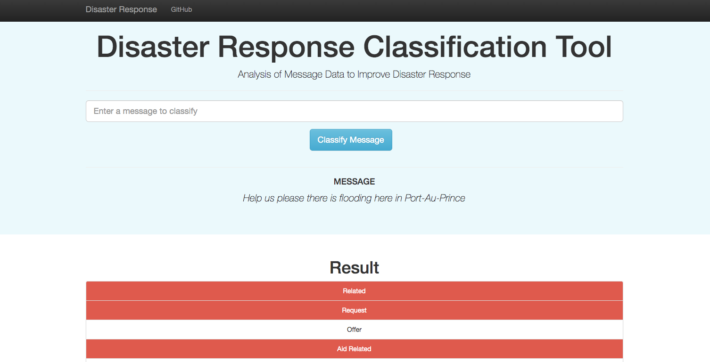
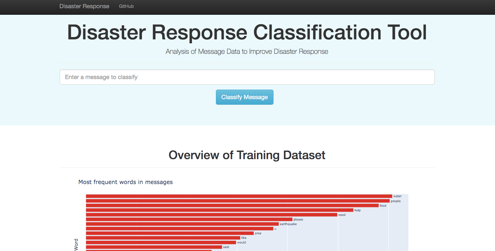

# Disaster Response Pipeline 
A machine learning/NLP pipeline for classifying messages into disaster response categories, deployed as a dashboard. \
The dashboard looks like this: \



## Table of Contents
[1. Installation and Data](#installation-and-data) \
[2. Project Motivation](#project-motivation) \
[3. File Descriptions](#file-descriptions) \
[4. Instructions](#instructions) \
[5. Licensing, Authors, and Acknowledgements](#licensing) 


## Installation and Data
The data was provided through Udacity Data Science Nano Degree, by [Figure Eight/Appen](https://appen.com/).
Requires Python versions 3.\*. Other requirements are available in the `requirements.txt` file. Directions for 
installation of requirements outlined in the [instructions](#instructions) section.

## Project Motivation
For this project, I aimed to build and tune a natural language processing pipeline in order to classify new messages into the relevant disaster response categories. The end goal was to create a dashboard/web app where new messages could be manually input and classified, using the classifier trained on the provided training data. 

## File Descriptions
Files in this repository (only those specific to the app) are organized as follows: \
```
├── app
    ├── run.py              # File for rendering and running the web-app
    ├── templates
        ├── master.html     # HTML for rendering the main web page
        ├── go.html         # HTML for rendering the results of entering a message query
    ├── static
        ├── img             # Folder containing images rendered on web pages
├── data
    ├── disaster_categories.csv     # File containing the categories all messages are associated with (labels)
    ├── disaster_messages.csv       # File containing all messages and associated genre 
    ├── process_data.py             # File that processes the CSV data and inserts into SQL table - requires CSV filenames
├── models
    ├── train_classifier.py         # File to run, calling SQL table, to train the classifier and save model
    
```
## Instructions
1. Clone the GitHub repo or download the zip file. In the project's root directory, install all necessary
    packages at once by running the following command: \
    `pip install -r requirements.txt`. 
2. Run the following commands in the project's root directory to set up the database and model.

    - To run ETL pipeline that cleans data and stores in database
        `python data/process_data.py data/disaster_messages.csv data/disaster_categories.csv data/DisasterResponse.db`
    - To run ML pipeline that trains classifier and saves
        `python models/train_classifier.py data/DisasterResponse.db models/classifier.pkl`

3. Run the following command in the app's directory to run your web app.
    `python run.py`

4. Go to http://0.0.0.0:3001/


## Licensing, Authors, Acknowledgements <a name="licensing"></a>
I give credit to [Udacity](https://www.udacity.com/) (part of the Data Science NanoDegree) for making the data
available from Figure Eight/Appen.


